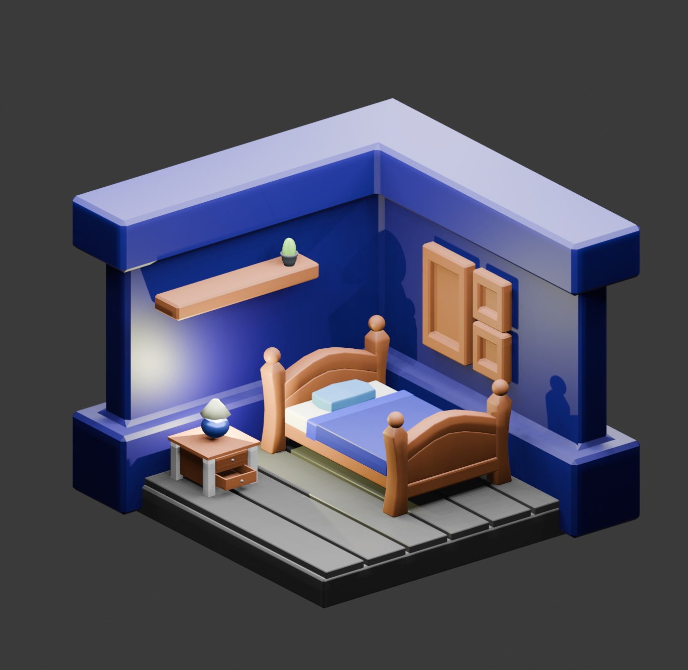

+++
title = 'Learning Blender in 2024'
date =  '2024-01-20T20:50:10-07:00'
showAuthor = false # Default author
authors = ['mslanker'] # Authors other than default
description = 'Maybe it will take this time.'
draft = false
+++

Ok, here we go again.  It is 2024 and this time I'm going to learn Blender.  For real.  Seriously!  Ok, ok, I know I have said that before.  Yes, I know too many times to count.  However, I have a plan this time.  I am going to lay it out for you right here, right now.  And I am even going to show you what I have accomplished thus far.

## The Plan
As mentioned, Blender has defeated me many times before and in order to not get sent home with my tail between my legs again we are going to break learning down into steps.  More importantly we are going to define our goal here as well.

>**The Goal**: Become proficient enough in Blender to make basic objects and not be so intimidated by it that you never open it.

Sounds easy enough, right?  So what exactly do I mean?  Well looking at my current skill set, especially pertaining to programming, I noticed something important.  There is the hurdle with a language where if I have to look up every single keyword, I don\'t want to try and use the language because it is "too slow".  I need to be able move as fast as I think or at least feel like my tool of choice is not an impediment (This also happened with typing until I sat down and learned to touch type).  So for Blender this means because able to manipute the basic shapes.  That can be through modifiers, boolean logic, manually editing (scaling, moving, changing) primitives, sculting, or even subdivision.  What are all of those?  I don't know all of them yet but I havea base understanding of how they differ and I think that is a good enough start.  So, now that we know what we want to accomplish let's take a look at our first task.

#### Get an Overview of the Tool
Blender has lots of knobs and switches. So many so it overwhelms most.  Also until Blender 2.8 the default controls didn't really feel... sane.  That being said we need a nice list of things.  Preferably something we can come back to again and again as we need it.  Let's just let it all wash over us and hope when the time comes we will think, "hey, I know that is possible let me see what that was called again" and consult our resource.  For me, this is one such resource: [Learn Blender 3D in 20 minutes. Blender tutorial for Absolute Beginners (2023)](https://www.youtube.com/watch?v=Rqhtw7dg6Wk) The video has numerous bookmarks, it is clear and concise.  I think it will do just nice.

Again, let that wash over us and keep coming back to it.  Next up we need a project.  Ideally something complex enough that we are force to interact with the program beyond rotating the default cube around.  Many people swear by this one:
[Blender 3D - Create and isometric BEDROOM in 15 minutes | Beginner Tutorial](https://www.youtube.com/watch?v=yCHT23A6aJA).  So yeah, don't expect to get that done in 15 minutes.  It took me well over a day between the litle free time I have and how many times I had to stop and rewind, while trying to figure out what I did wrong because the buttons I just pushed didn't do what they did for him.  (Note: many times he hops in and out of edit mode but doesn't mention this. You eventually get a feel for it.  Which is kind of the point of an exercise like this.)  Now that we have our +1 learning task how do we use it.  No, we don't just watch it and blindly follow along.  If we do that we are guaranteed to learn next to nothing.  Here is what we want to do.

1. Go through the video pausing / rewinding as necessary.  Repeat each step as explained in the video.  I promise you there will be things that don't make sense.  Watch the video very very closely.  Look for details like what mode the guy is in or where the origin point is or where the 3D cursor is located.  Lots of little things tha make a difference and you will start to get a feel of the different parts.
2. Don't be afraid to nuke part of the scene and start again.  I did this a number of times.  I got to the point where I could build the entire nightstand from memory.  I suggest you do try to do that as well.
3. Tweak each and everything you make.  Since it is a video that you can pause and rewind as many times as you'd like.  Make sure to have fun.  Try thngs with each piece that you make.  What happens if I add this modifier, what does this keyboard shortcut do, etc.
4. Speaking of keyboard shortcuts.  You will want to learn them.  Redo some of the things you are shown in the video just to help build the muscle memory for the shortcuts.
5. Don't stray too far.  It is ok to add a layer of detail to one of the items in the scene.  You can even try creating your own item assuming you aren't going to go off an try to sculpt the Statue of Liberty or something too ambitious.
6. Repeat, repeat, and repeat.  Rebuild the components that make up the different items or hell, recreate the scene from memory as best as you can.  Do this at least until you feel comfortable with the basic keyboard shortcuts and feel especially comfortable moving objects around in 3D space.

#### Tackle a Newer, Slightly More Difficult Project
Ok, we made a bedroom, rendered it, and maybe added our own personal touch.  Let's find a longer, slightly more difficult tutorial. Something that uses shapes not easily made from primitives.  Perhaps something a bit more... organic?

My recommendation is this: (Link's Awakening: Link Tutorial)[https://www.youtube.com/playlist?list=PL5F48bE3OZbuaotqwyqWDI1UZvUTEiJSX]  This looks sufficiently long, Zeld... er I mean Link is has a number of round edges and even better when we are done we will have something we can learn to pose.  Same rules from before apply here as well.  Don't just blindly follow, expirement where possible, be sure to repeat new things that come up, and keep using those keyboard shortcuts.

At the time of this writing, I have watch that first video about 4 separate times now.  Two times were end to end.  The other two I hopped around to find what I needed to know.  Really take advantage of those bookmarks.

I have also worked through building the bedroom diorama.  Which I am working on a write up for it as well. Check back for updates.  As a teaser, I will at least show the finished product here:

> Bonus: I happened upon this video and got inspired: [Get that 2D look in 3D!](https://www.youtube.com/watch?v=5Idffj0gjIs)