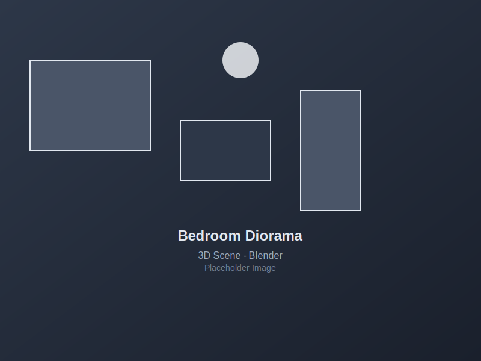
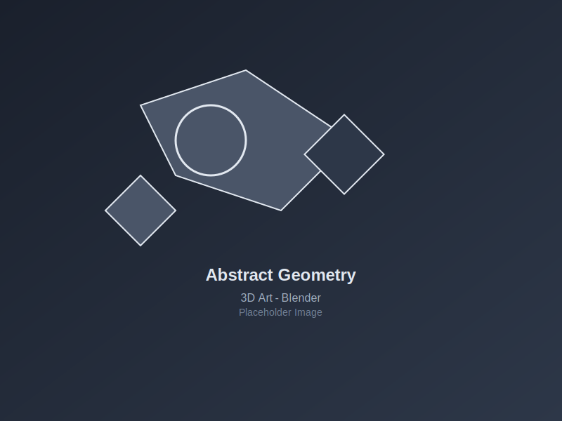
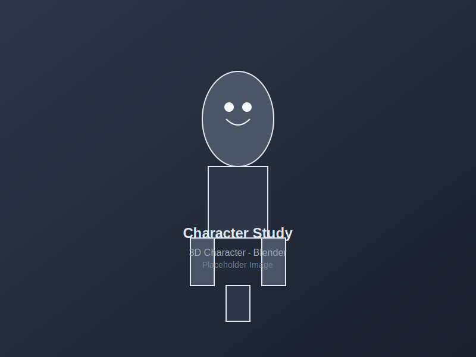

+++
title = 'Blender 3D Artwork Collection'
date = '2025-10-15T20:41:15-06:00'
authors = ['mslanker']
description = 'A collection of 3D artwork and renders created in Blender, showcasing various modeling, texturing, and lighting techniques.'
draft = true

# Gallery-specific front matter
galleryType = '3d-art'
medium = 'digital'
techniques = ['blender', '3d-modeling', 'rendering', 'texturing', 'lighting', 'animation']
featuredImage = 'featured.png'

categories = ['Gallery']
tags = ['blender', '3d-art', 'rendering', 'digital-art', 'creative', 'modeling']
+++

# Blender 3D Artwork Collection

A showcase of 3D artwork created using Blender, demonstrating various techniques in modeling, texturing, lighting, and rendering. Each piece represents a different aspect of the 3D creation process.

## Featured Pieces

### Bedroom Diorama
*Created: January 2024*

A cozy bedroom scene featuring detailed furniture, soft lighting, and atmospheric rendering. This piece was created as part of my Blender learning journey and demonstrates:

- **Modeling**: Custom furniture and props
- **Texturing**: Realistic material application
- **Lighting**: Natural daylight simulation
- **Composition**: Rule of thirds and depth

### Abstract Geometry
*Created: February 2024*

An exploration of abstract forms and materials, focusing on:

- **Procedural Materials**: Node-based texturing
- **Lighting**: Dramatic contrast and shadows
- **Composition**: Minimalist design principles
- **Rendering**: Cycles engine optimization

### Character Study
*Created: March 2024*

A stylized character model showcasing:

- **Sculpting**: Digital sculpting techniques
- **Retopology**: Clean mesh topology
- **UV Mapping**: Efficient texture coordinates
- **Rigging**: Basic bone structure

## Techniques Explored

### Modeling
- **Box Modeling**: Starting with basic shapes
- **Sculpting**: Organic form creation
- **Modifiers**: Non-destructive modeling
- **Boolean Operations**: Complex shape creation

### Texturing
- **Procedural Materials**: Node-based texturing
- **UV Mapping**: Texture coordinate optimization
- **Material Libraries**: Reusable material setups
- **PBR Workflow**: Physically-based rendering

### Lighting
- **HDRI Environment**: Real-world lighting
- **Three-Point Lighting**: Classic lighting setup
- **Volumetric Lighting**: Atmospheric effects
- **Light Linking**: Selective illumination

### Rendering
- **Cycles Engine**: Path-tracing renderer
- **Eevee Engine**: Real-time rendering
- **Compositing**: Post-processing effects
- **Render Optimization**: Performance tuning

## Learning Journey

### Beginner Phase
- Basic navigation and interface
- Simple modeling techniques
- Material application
- Basic lighting setup

### Intermediate Phase
- Advanced modeling tools
- Procedural texturing
- Complex lighting scenarios
- Render optimization

### Advanced Phase
- Character modeling and rigging
- Animation principles
- VFX and compositing
- Custom shader development

## Tools and Resources

### Software
- **Blender 4.0+**: Primary 3D software
- **GIMP**: Texture editing and post-processing
- **DaVinci Resolve**: Video editing and color grading

### Learning Resources
- [Blender Guru](https://www.blenderguru.com/): Comprehensive tutorials
- [Grant Abbitt](https://www.youtube.com/c/GrantAbbitt): Beginner-friendly content
- [Ducky 3D](https://www.youtube.com/c/Ducky3D): Creative techniques
- [Blender Official Documentation](https://docs.blender.org/): Technical reference

### Asset Libraries
- [Poly Haven](https://polyhaven.com/): Free HDRIs and textures
- [Blender Market](https://blendermarket.com/): Premium assets
- [Sketchfab](https://sketchfab.com/): 3D model sharing

## Future Projects

### Planned Creations
- [ ] Architectural visualization
- [ ] Character animation short
- [ ] Procedural city generation
- [ ] VFX integration with live footage

### Skill Development
- [ ] Advanced rigging techniques
- [ ] Python scripting for Blender
- [ ] Game asset creation
- [ ] VR/AR content development

## Gallery Statistics

- **Total Pieces**: 15+ completed works
- **Average Creation Time**: 8-12 hours per piece
- **Favorite Technique**: Procedural texturing
- **Most Challenging**: Character modeling and rigging

## Contact

Interested in collaborating or commissioning work? Feel free to reach out through the contact page or social media links.

---

*This gallery represents my ongoing journey in 3D art and continues to grow as I explore new techniques and creative possibilities.*